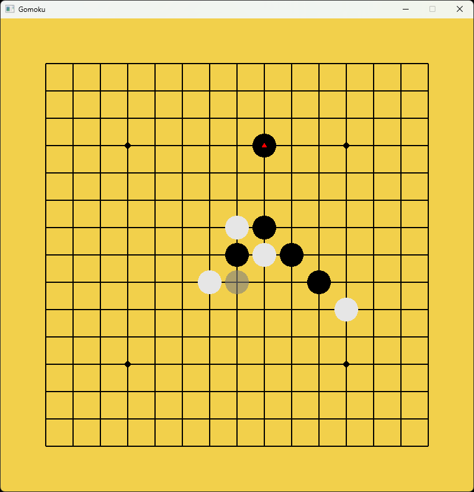

# Gomoku

A simple gomoku, using [SFML] framework, supports mouse/keyboard/controller input and LAN connection.  

## Rules

The rules are **free-style** and there are no forbidden moves. Players can decide the order of play in each round.  

## Modes

- Online: one person acts as a server and the other as a client to play games online.
- Offline: playing games in turns with two players in an offline environment.

## Keymap

### Keyboard

| Key                                        | Action          |
| ------------------------------------------ | --------------- |
| `Space`                                    | Place chess     |
| `Backspace`                                | Undo            |
| `W`/`A`/`S`/`D`/`Up`/`Down`/`Left`/`Right` | Move the cursor |

### Controller

| Key          | Action          |
| ------------ | --------------- |
| `A`/`Cross`  | Place chess     |
| `B`/`Circle` | Undo            |
| D-pad        | Move the cursor |

[SFML]: https://github.com/SFML/SFML
